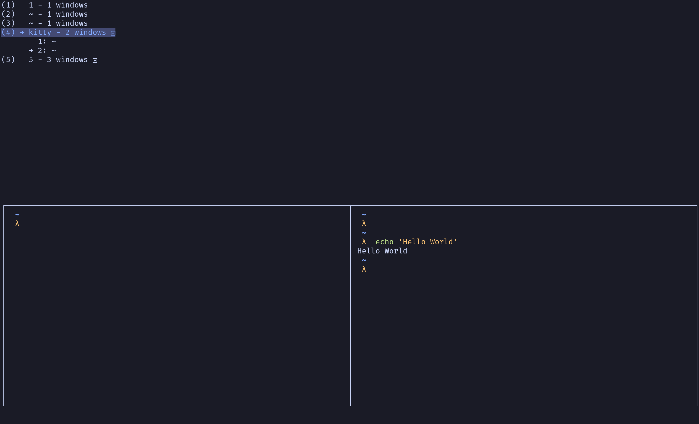

# Kitty-mux
A Custom [kitten](https://sw.kovidgoyal.net/kitty/kittens/custom/) to mimic tmux's multiplexer feature: it enables a number of kitty tabs or windows to be created, accessed, and controlled from a single screen.



## Motivation 
[tmux](https://github.com/tmux/tmux) is very useful as a sessions/windows browser for terminal. However, it's very slow if you do things like opening multiple Neovim instances when running a project, or running an AI model like ollama, even if you combine with a fast terminal like [alacritty](https://github.com/alacritty/alacritty), which doesn't support tabs/windows by itself.
Therefore, I decided to switch to kitty, and realized that I could customized a kitten to replace tmux.
This is a tool to give kitty the similar features. The idea is to bind a hotkey to run a tabs/windows browser in kitty so that you can jump to known windows with vim-like key bindings.

## Installation

```shell
git clone git@github.com:CaeChao/kitty-mux.git ~/.config/kitty/kitty-mux
```

## Getting Started
You'll need to:
* allow remote control in kitty
```shell
allow_remote_control yes
```

* create kitty mappings

For example:
```shell
# Window/Tab management
map ctrl+a>w kitten kitty-mux/tab_switcher.py # use ctrl+a as prefix + w to list tabs
tab_bar_style hidden
map ctrl+a>$ set_tab_title " "
enabled_layouts splits:split_axis=horizontal,stack,grid

# Layout
map ctrl+a>space next_layout
map ctrl+a>z toggle_layout stack
map ctrl+a>% launch --location=vsplit --cwd=current
map ctrl+a>shift+' launch --location=hsplit --cwd=current
map ctrl+a>c launch --type=tab --cwd=current
map ctrl+a>t  new_tab !neighbor

# Movement
map ctrl+a>h previous_window
map ctrl+a>l next_window
map ctrl+a>j neighboring_window down
map ctrl+a>k neighboring_window up
map ctrl+a>shift+[ move_window left
map ctrl+a>shift+] move_window right

map ctrl+a>p previous_tab
map ctrl+a>n next_tab
map ctrl+a>shift+, move_tab_backward
map ctrl+a>shift+. move_tab_forward

map ctrl+a>x close_window
map ctrl+a>q close_tab

map ctrl+a>1 goto_tab 1
map ctrl+a>2 goto_tab 2
map ctrl+a>3 goto_tab 3
...
```


## Features

- [x] Easily view and navigate a list of Tabs, and Windows within Kitty
- [ ] Save/Restore tabs like sessions in tmux

## Not Covered
* OS level windows displaying and switching, since the OS level windows won't be able to run in a single screen by Kitty's design, the management of OS level windows should be the responsibilities of a window manager like [i3](https://i3wm.org), [awesomewm](https://awesomewm.org/), or [yabai](https://github.com/koekeishiya/yabai)(MacOS) combines with a window switcher like [Rofi](https://github.com/davatorium/rofi)


## Credit
This custom Kitten is a customized port of [kimlai](https://github.com/kimlai/dotfiles/blob/9dea2453c5bdc96bd2bfa0fe1ea0f8f5b8593b60/kitty/session_switcher.py)

